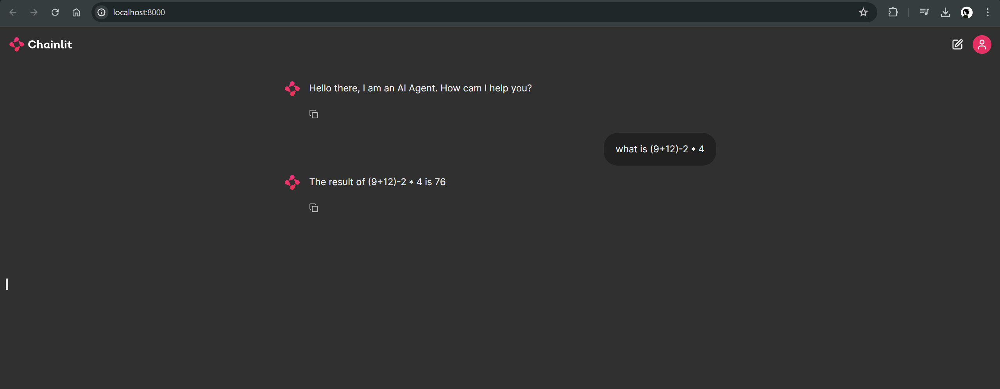
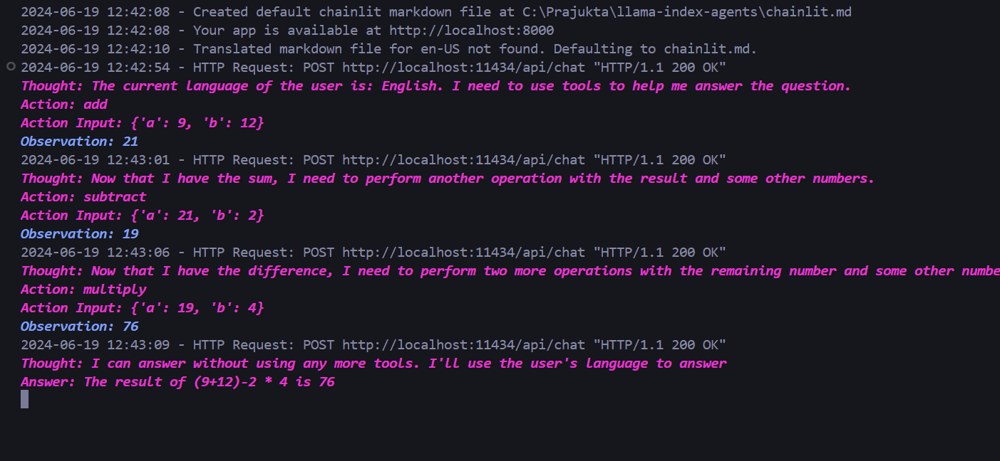

# Basic Calculator AI Agent

This project sets up an AI agent that performs basic mathematical operations using the Llama Index framework and the Ollama model. The agent can handle addition, subtraction, multiplication, and division of integers based on user input.

## Features

- **Addition:** Adds two integers.
- **Subtraction:** Subtracts one integer from another.
- **Multiplication:** Multiplies two integers.
- **Division:** Divides one integer by another.

## Prerequisites

- Python
- `nest_asyncio`
- `chainlit`

## Installation

1. **Clone the repository:**
   ```sh
   git clone https://github.com/prajuktadey/agent-basic-calculator
   cd agent-basic-calculator

2. **Install the required libraries:**
```sh
pip install nest_asyncio chainlit
```
3. ***Start the Chainlit server:***

````sh
chainlit run app.py
````

4. ***Interact with the AI Agent:***

- **Open the provided URL in your browser.** 
- **The agent will greet you and you can input mathematical expressions for it to solve.**

  ## Overview

Below is a visual representation of how it works:




